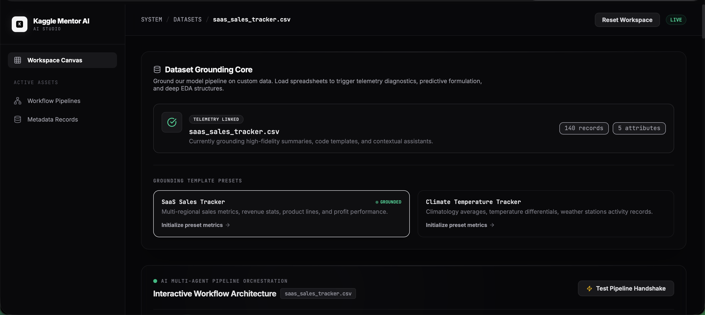
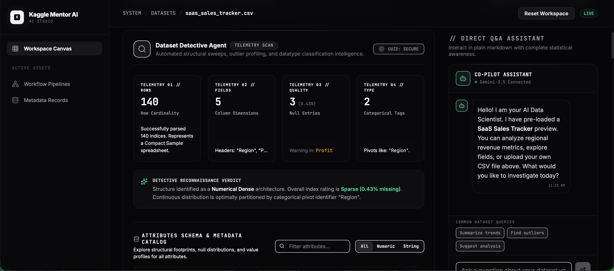
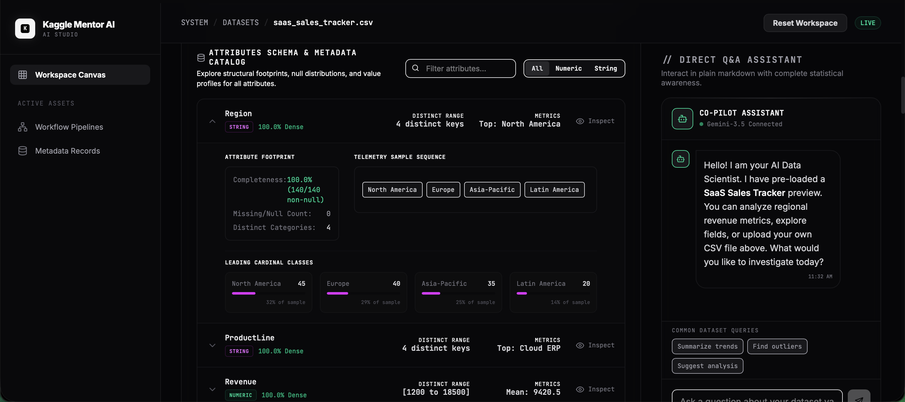
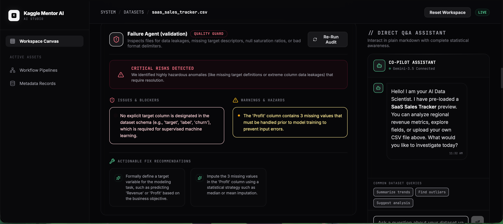
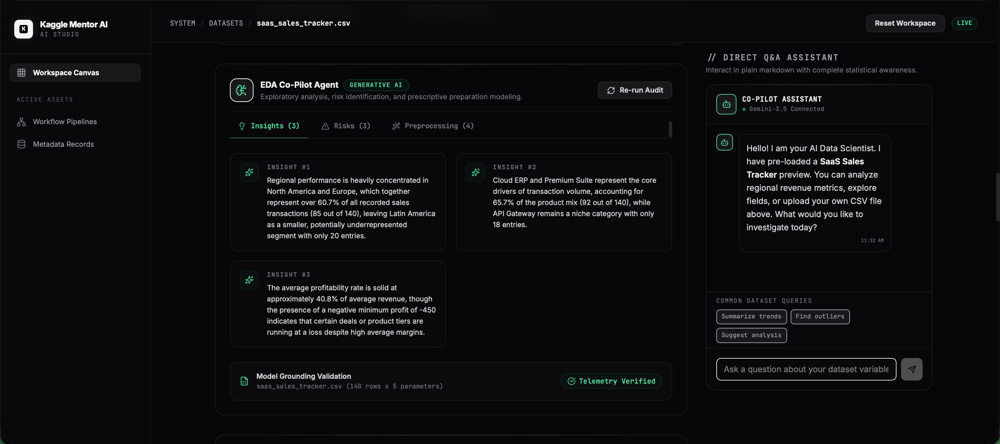
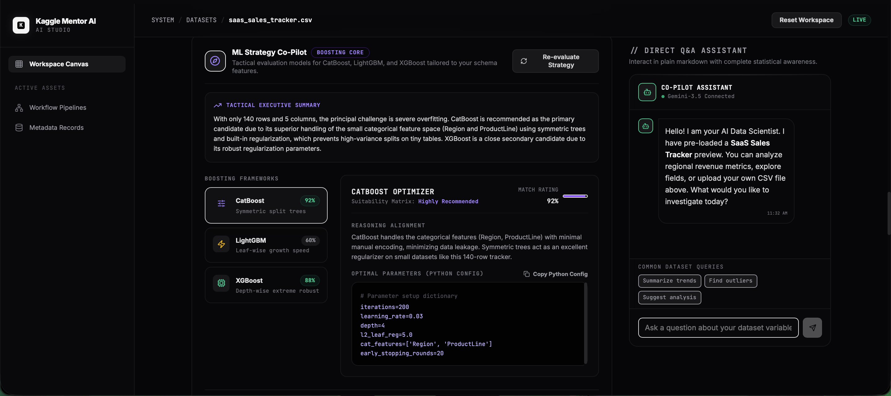
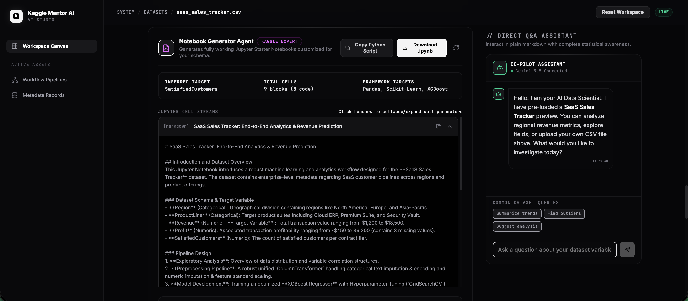
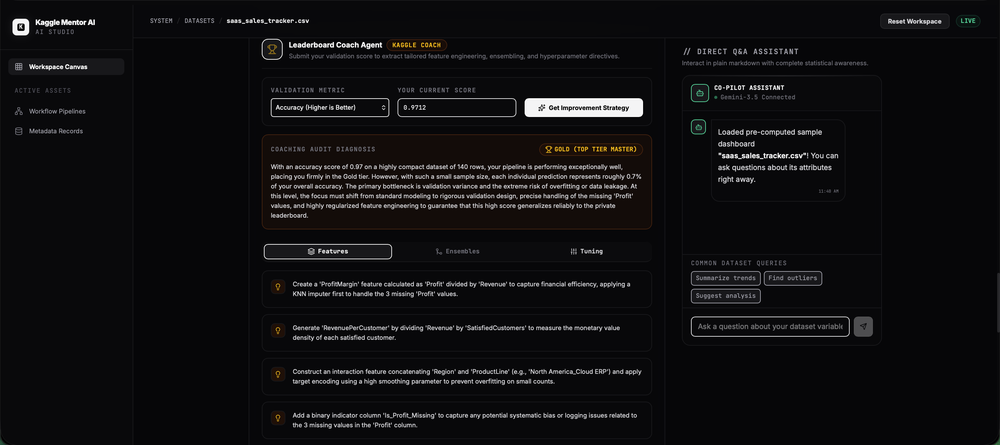
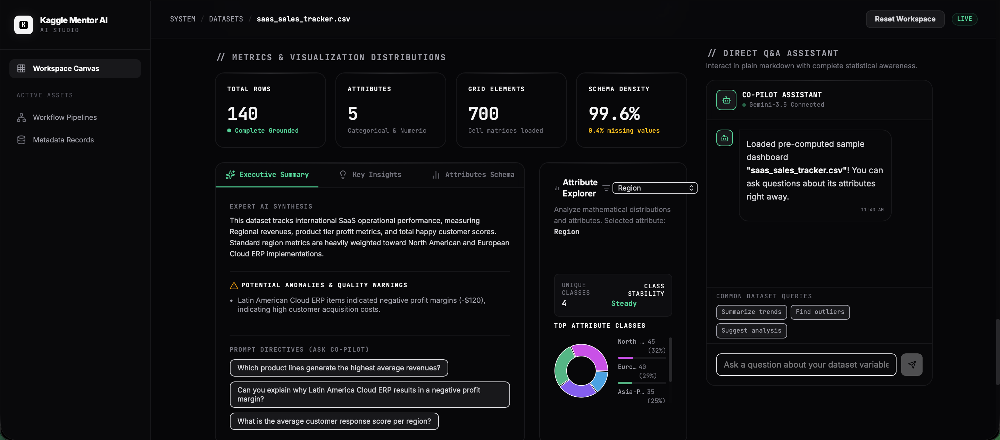

<div align="center">

# 🚀 Kaggle Mentor AI

### Your AI Companion for Kaggle Competitions

An AI-powered multi-agent platform that helps beginners and experienced data scientists navigate Kaggle competitions—from understanding datasets to generating notebooks and preparing submissions.


---

## 🏆 Kaggle Vibe Coding Agents Capstone Project

*Empowering Kaggle enthusiasts with AI-driven guidance from dataset exploration to competition submission.*

</div>

---

# 📚 Table of Contents

- [Problem Statement](#-problem-statement)
- [Solution](#-solution)
- [Overview](#-overview)
- [Demo](#-demo)
- [Features](#-features)
- [Multi-Agent Architecture](#-multi-agent-architecture)
- [Why Multi-Agent?](#-why-multi-agent)
- [Tech Stack](#-tech-stack)
- [Installation](#-installation--running-the-application)
- [Available Scripts](#-available-scripts)
- [Workflow](#-workflow)
- [Technical Highlights](#-technical-highlights)
- [Deployment](#-deployment)
- [Future Roadmap](#-future-roadmap)
- [Contributing](#-contributing)
- [Acknowledgements](#-acknowledgements)
- [Contact](#-contact)

---

# 🎯 Problem Statement

Kaggle competitions involve multiple complex stages including dataset understanding, exploratory data analysis, feature engineering, model selection, notebook creation, model evaluation, and submission generation.

Beginners often struggle to determine the next step, while experienced participants spend considerable time performing repetitive tasks.

There is currently no unified AI assistant capable of guiding users throughout the complete competition workflow.

Kaggle Mentor AI addresses this challenge through a collaborative multi-agent architecture where specialized AI agents work together to provide intelligent, contextual assistance at every stage of the competition lifecycle.

---

# 💡 Solution

Kaggle Mentor AI introduces a modular multi-agent system where each AI agent specializes in a specific task.

Instead of relying on a single general-purpose chatbot, multiple specialized agents collaborate to:

• Analyze datasets
• Perform exploratory data analysis
• Recommend ML strategies
• Generate starter notebooks
• Guide submission preparation

This architecture produces more focused, explainable, and context-aware recommendations while improving maintainability and scalability.

---

# 📖 Overview

Kaggle Mentor AI is an intelligent **multi-agent AI platform** designed to simplify the entire Kaggle competition workflow.

Rather than functioning as a traditional chatbot, the application orchestrates multiple specialized AI agents that collaborate to guide users through every stage of a Kaggle competition—from understanding the dataset to generating competition-ready notebooks and submission files.

Whether you're participating in your **first Kaggle competition** or aiming to climb the leaderboard, Kaggle Mentor AI provides structured, AI-powered assistance throughout your journey.

---

## 🎥 Demo

📺 **YouTube Demo**

https://www.youtube.com/watch?v=QY6ccoUa9B8

---

🌐 **Live Demo**

https://kaggle-mentor-ai-409406860748.asia-southeast1.run.app

---

# ✨ Features

## 📊 Dataset Analysis Agent

- Automatic dataset understanding
- Target variable detection
- Missing value analysis
- Feature overview
- Data summary generation

---

## 📈 Exploratory Data Analysis (EDA)

Automatically generates insightful visualizations including:

- Distribution plots
- Correlation heatmaps
- Feature statistics
- Data summaries
- Missing value reports

---

## 🤖 AI Strategy Agent

Receive intelligent recommendations for:

- Data Cleaning
- Feature Engineering
- Model Selection
- Cross Validation
- Hyperparameter Tuning
- Performance Optimization

---

## 📝 Notebook Generation

Automatically generates starter notebooks including:

- Data Loading
- Data Cleaning
- Feature Engineering
- Model Training
- Evaluation
- Prediction
- Submission File Creation

---

## 🏆 Competition Assistant

Helps users:

- Understand competition objectives
- Interpret evaluation metrics
- Recommend ML workflows
- Improve leaderboard performance

---

## 🧠 Multi-Agent Architecture

```
                    User
                      │
                      ▼
        React + TypeScript Frontend
                      │
             Prompt Routing Layer
                      │
      ┌──────────┬──────────┬───────────┐
      ▼          ▼          ▼           ▼
 Dataset     EDA Agent  Strategy   Notebook
  Agent                  Agent      Agent
      │
      ▼
 Submission Agent
      │
      ▼
 Gemini API
```

Each agent focuses on a specialized responsibility while collaborating with the others to create an intelligent end-to-end workflow.

---

# 🧠 Why Multi-Agent?

Traditional AI assistants attempt to solve every task using a single prompt.

Kaggle Mentor AI instead decomposes the workflow into specialized intelligent agents.

| Traditional Chatbot | Kaggle Mentor AI |
|---------------------|------------------|
| Single Prompt | Multiple Specialized Agents |
| Generic Responses | Domain Expertise |
| Limited Workflow Context | End-to-End Competition Guidance |
| Difficult to Scale | Modular Architecture |

---

# 🖥️ Tech Stack

| Technology | Purpose |
|------------|----------|
| React | Frontend Framework |
| TypeScript | Static Type Checking |
| Vite | Development & Build Tool |
| Tailwind CSS | UI Styling |
| AI APIs | Intelligent Responses |
| Multi-Agent Architecture | Agent Collaboration |

---

# 🚀 Installation & Running the Application

## Prerequisites

Install the following:

- Node.js (v18+ recommended)
- npm
- Git

Verify installation:

```bash
node -v
npm -v
git --version
```

---

## 1️⃣ Clone the Repository

```bash
git clone https://github.com/Yuwin2008/Kaggle-Mentor-AI.git
```

---

## 2️⃣ Navigate into the Project

```bash
cd Kaggle-Mentor-AI
```

---

## 3️⃣ Install Dependencies

```bash
npm install
```

or

```bash
npm i
```

---

## 4️⃣ Configure Environment Variables

Create a `.env` file in the project root.

Example:

```env
VITE_API_KEY=your_api_key
```

If applicable, add additional API keys such as:

```env
VITE_GEMINI_API_KEY=your_api_key
VITE_OPENAI_API_KEY=your_api_key
VITE_SUPABASE_URL=your_project_url
VITE_SUPABASE_ANON_KEY=your_anon_key
```

---

## 5️⃣ Start the Development Server

Run:

```bash
npm run dev
```

The application will be available at:

```text
http://localhost:5173
```

Vite automatically reloads the application whenever you save changes.

---

## 6️⃣ Build for Production

```bash
npm run build
```

The optimized production build will be generated inside the `dist/` directory.

---

## 7️⃣ Preview the Production Build

```bash
npm run preview
```

Open:

```text
http://localhost:4173
```

---

## 8️⃣ Lint the Project

```bash
npm run lint
```

---

# 📜 Available Scripts

| Command | Description |
|----------|-------------|
| `npm install` | Install project dependencies |
| `npm run dev` | Start the development server |
| `npm run build` | Build production files |
| `npm run preview` | Preview production build |
| `npm run lint` | Run ESLint |

---

# 🛠 Troubleshooting

### Missing Dependencies

```bash
rm -rf node_modules package-lock.json
npm install
```

---

### Port Already in Use

If port **5173** is occupied, Vite automatically assigns another available port.

---

### Environment Variables Not Loading

- Ensure the file is named `.env`
- Prefix variables with `VITE_`
- Restart the development server after changes

---

# 📸 Screenshots

## Home Page


## Dataset Detective Agent


## Dataset Analysis


## Failure Agent


## EDA CoPilot Agent


## ML Strategy CoPilot Agent


## Notebook Creator Agent


## Leaderboard Coach Agent


## Visualization Agent


---

# 🔄 Workflow

```text
Competition
      │
      ▼
Dataset Analysis
      │
      ▼
Exploratory Data Analysis
      │
      ▼
Strategy Recommendation
      │
      ▼
Notebook Generation
      │
      ▼
Model Training
      │
      ▼
Submission File
```

---

#  Technical Implementation

Kaggle Mentor AI follows a modular frontend architecture built with React and TypeScript.

The application routes user requests through a prompt routing layer that delegates tasks to specialized AI agents.

Each agent has a clearly defined responsibility, reducing prompt complexity while improving maintainability and scalability.

The application also utilizes:

- Component-based React architecture
- Modular TypeScript design
- Environment-based API configuration
- Reusable UI components
- Prompt routing
- Multi-agent orchestration

---

# 🌟 Why Kaggle Mentor AI?

- ✅ Beginner Friendly
- ✅ AI-Powered Guidance
- ✅ Multi-Agent Collaboration
- ✅ End-to-End Workflow
- ✅ Faster Learning
- ✅ Intelligent Recommendations
- ✅ Modern Responsive Interface

---

# ☁ Deployment

The application is deployed on Google Cloud Run.

Live URL:

https://kaggle-mentor-ai-409406860748.asia-southeast1.run.app

---

# 🔮 Future Roadmap

✅ Authentication

✅ Persistent Memory

✅ AutoML

✅ Team Collaboration

✅ Cloud Notebook Execution

✅ Leaderboard Analytics

✅ Model Explainability

✅ Competition Timeline

✅ Dataset Version Tracking

✅ Multi-LLM Support

✅ Agent Memory

---

# 🤝 Contributing

Contributions are welcome!

1. Fork the repository
2. Create a feature branch
3. Commit your changes
4. Push the branch
5. Open a Pull Request

---

# ❤️ Acknowledgements

Built as part of the Kaggle Vibe Coding Agents Capstone.

Special thanks to the Kaggle community and everyone contributing to open-source AI and machine learning.

---

# 📬 Contact

### 👨‍💻 GodofThunder2407(R.L.Yuwin)

**GitHub:**  
https://github.com/Yuwin2008

**Discord:**  
godofthunder_2407

**YouTube:**  
https://www.youtube.com/@GodofThunder2407

---

<div align="center">

## ⭐ If you found this project useful, please consider giving it a Star!

Made by **GodofThunder2407 (R. L. Yuwin)**

</div>
